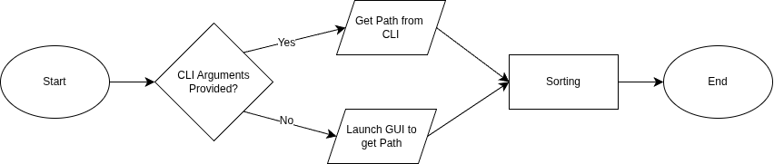

# FolderOrganizer

A small automation project to tiddy up your messy folder.



The flowchart above shows the workflow of this project.

The project can be accessed using two medium, that is through GUI and CLI which accepts a string of folder path, then the script will automatically create directories based on the extension of the file.

To run it, you can try:

CLI Mode

```
python your_script_name.py "/Users/YourUser/Downloads"
```

GUI Mode

```
python your_script_name.py
```
